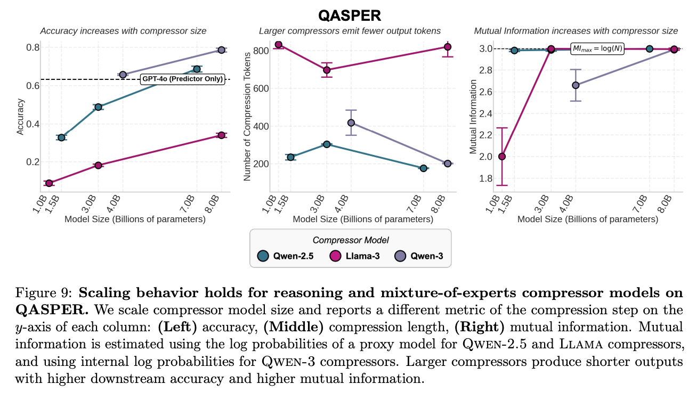

# 2/11/26
Started to run experiments on QASPER. Reference from paper below.

On seed 42 subset of 20 QA pairs, with Qwen235-instruct as judge, Llama3.3-70B + Llama3.1-8B gets 25%.

On this same subset, LLama3.3-70B + Qwen2.5-7B gets only 5% -- this contradicts the paper's results, and makes me suspicious of my implementation

